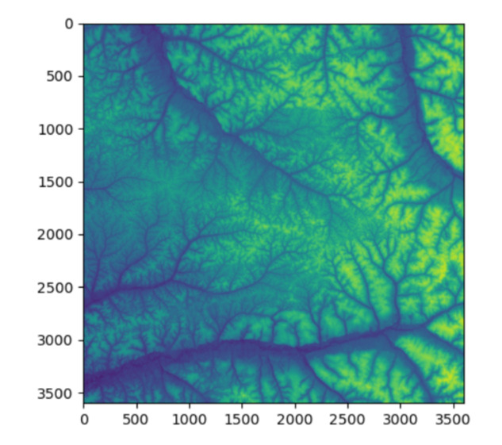
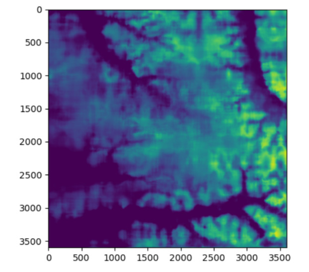

# It's a Small World

### Terrain-Aware compression via Content Mixing

## CNN Compression

We used fourier features as input to a convolutional neural network for compression. We minimised the entropy measured between the original image and the output image as loss.

### How to run it

`python train.py` to run the trainer. You will need to have the jax ecosystem installed on your python environment.

Use `python predict.py` to run the predicter.

## Comparison of input and prediction from CNN




## Compression Results

Original RAW stats
  ```
count: 60
  total: 1,556,064,120 bytes (1483.98 MiB)
  min:   25,934,402 bytes
  max:   25,934,402 bytes
  avg:   25,934,402.00 bytes
```

Predictor stream stats ()
  ```
count: 60
  total: 382,916,301 bytes (365.18 MiB)
  min:   20,302 bytes
  max:   10,210,383 bytes
  avg:   6,381,938.35 bytes
```

Compression summary
  ```
  predictor/raw ratio:     0.246080 (savings 75.39%)
```

Round-trip validation
  ```
codes_exact_match_files:  60
  codes_non_exact_files:    0
  global_mae:              0.000000
```
### Compared to NASA .tif


### Compared to State of the Art Compression Tools

Compression comparison vs RAW
```
  LZW      ratio=0.3092  savings=69.08%
  ZSTD     ratio=0.2964  savings=70.36%
  DEFLATE  ratio=0.3007  savings=69.93%
  LERC     ratio=0.4317  savings=56.83%
```

