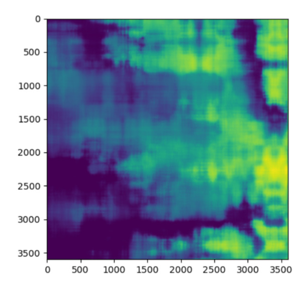

# It's a Small World

### Terrain-Aware compression via Content Mixing

## CNN Compression

We used fourier features as input to a convolutional neural network for compression. We minimised the entropy measured between the original image and the output image as loss.

### How to run it

`python train.py` to run the trainer. You will need to have the jax ecosystem installed on your python environment.

Use `python predict.py` to run the predicter.

## Comparison of input and prediction from CNN

